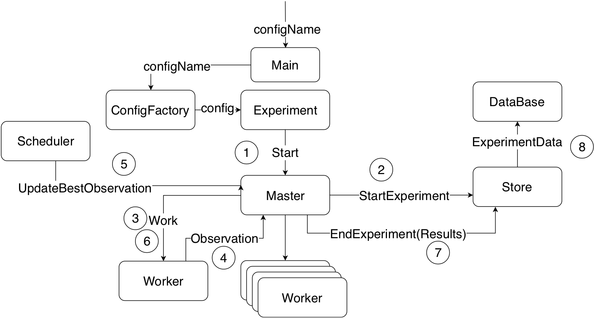

#Distributed BlackBox Optimisation in Scala 

The goal of BlackBox optimization is to find the minimum (or the maximum) of a function
for which the analytic form is not known (which is almost always the case).

The idea is to sample the function (to try different input values) until you find one that is good enough. 

The easiest way to so : 
```scala
while(progress > stoppingCriteria) { // Iterate until you progressed enough 
  val sample = makeRandomSampleInDomain() // Make a random choice 
  val result = evaluateSample(sample) // Check how good you did
  if(result < currentBestResult) // If you did better than before 
    progress = abs(currentBestSample - sample) // update progress and your current best choice 
    currentBestSample = sample
    currentBestResult = result
}
```

Note that this algorithm might stop before being anywhere close to the minimum of the function. 

```scala
progress = abs(currentBestSample - sample)
```
`progress` could be very small if you happen to sample very close to the `currentBestSample` 
(the while loop will stop if `progress` is smaller than `stoppingCriteria`).

To avoid this let's put some dampening so that `progress` does not change so fast. 
```scala
progress = (abs(currentBestSample - sample) + progress) / 2
```

## EpsilonGreedy 
Instead of sampling randomly in the domain, why not sample greedily? 
That means sampling close to the `currentBestSample`. 
We can use an EpsilonGreedy algorithm that takes a greedy action `epsilon` percent of the time and non-greedy action `1-epsilon` percent of the time. For example: 

```scala
def isGreedy = nextRandom() < epsilon // if epsilon is 0.3 => a greedy sample will be taken 30% of the time. 

def sample = {
    if (isGreedy) sampleInGreedyDomain
    else sampleInNonGreedyDomain
}
```


To set `greedyDomainSize`, 
I used `progress` so that `greedyDomainSize = const * progress` because as `progress` becomes smaller, 
we expect `greedyDomainSize` to get smaller also. 

## A Distributed approach (WIP)

Is there a way to improve the basic algorithm even more? 
Why not use parallelism? The function can be sampled by multiple workers
at the same time. Results would be sent to a Master that updates the  `currentBestResult`
until the `stoppingCriteria` is reached. 

Here is the architecture of the program that I propose. 



A User passes in a `configName` that a `ConfigFactory` uses to create the configuration object of the experiment. 
It basically contains hyperparameters such as `epsilon` and `stoppingCriteria` that are used to initialize all the different actors. 

- 1 : `Start` is sent to master. It triggers the experiment. 
- 2 : `Master` then sends a `StartExperiment` to the `Store` so it can keep track of when the experiment started. 
- 3 :  `Master` sends `Work` to each `Worker`. 
- 4 : `Worker` samples the function and collects `nbIter` observations. 
It returns the best observation to `Master`. 
- 5 : `Scheduler` sends `UpdateBestObservation` at regular intervals to `Master`. 
The update of the `currentBestObservation` is not done inline (when an observation is received)
because of raise conditions that can occur when two `Workers` send an observation at the same time. 
- 6 : We loop over 3, 4 and 5 until `stoppingCriteria` is reached. 
- 7 : When the experiment is done, `Master` gathers data and sends `EndExperiment` to the `Store`. 
- 8 : `Store` forwards the data to the `DataBase`. 


## KPI (WIP)

How should we evaluate the performance of this algorithm? 
At the end of the day, what matter is efficiency. 
How much energy do you have to put into it to get a result that 
is "good enough"?
For a simple function such as `x => (x -1) * x`, the electric power used to power the algorithm is not a concern. 
We are more interested in finding a solution in a short amount of time.
This is not necessarily the case when dealing with functions that are extremely expensive to evaluate. A metric for that could be the total number of function evaluations. 

From that we can describe 3 KPIs: 
- Total time: the difference between `EndExperiment` and `StartExperiment`
- Precision: the difference between the real min and the estimated min. 
This tells us how "good" the solution is.  
- Number of function evaluations 
  


